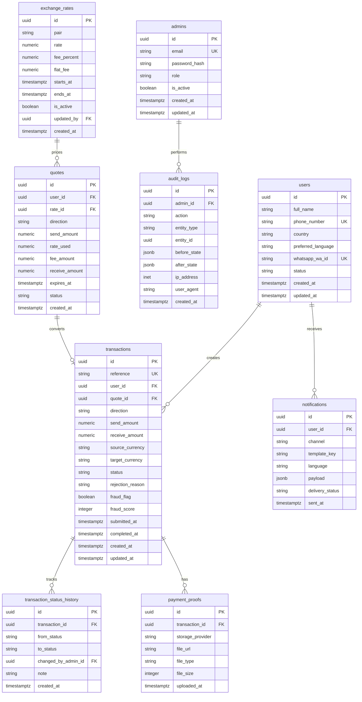

# Xcase — WhatsApp-First Cross-Border FX MVP (XOF ⇄ NGN)

## 1) Product Requirements Document (PRD)

### 1.1 Problem
Cross-border individuals and small merchants between Benin and Nigeria need a fast, trusted way to exchange XOF and NGN using the channel they already use daily: WhatsApp.

### 1.2 Goal
Validate demand and operational feasibility for a WhatsApp-first FX platform before investing in a full mobile app.

### 1.3 Success Metrics (MVP)
- 1,000 registered users in 90 days
- ≥ 25% weekly active users
- ≥ 300 completed transactions/month
- < 10 min median quote-to-order time
- < 30 min median order completion time (business hours)
- < 2% rejection due to preventable user errors

### 1.4 Scope (MVP)
In scope:
- WhatsApp onboarding and language selection (English/French)
- Registration (name, phone, country, language)
- Live rate display
- XOF→NGN and NGN→XOF quote + order creation
- Proof of payment upload
- Transaction status updates (Pending, Processing, Completed, Rejected)
- Transaction history
- Support handoff
- Admin dashboard for users, transactions, rates, metrics, exports

Out of scope:
- Mobile apps
- Automated bank payout integrations in both countries (manual ops accepted in MVP)
- Advanced KYC integrations (basic KYC only)

### 1.5 Personas
- **Retail Sender**: Sends money occasionally to family.
- **Micro-Merchant**: Frequent cross-border purchases.
- **Operations Admin**: Verifies payment proofs and settles orders.

### 1.6 Functional Requirements
1. First interaction asks user language (EN/FR), stored permanently.
2. User registration captures full name, phone, country, preferred language.
3. User can check current rates anytime.
4. User can request exchange in both directions (XOF/NGN).
5. Real-time quote includes amount sent, rate, amount received, expiry.
6. User uploads payment proof (image/PDF).
7. User receives status updates (Pending/Processing/Completed/Rejected).
8. User views transaction history.
9. User contacts support through WhatsApp flow.
10. All messages localize automatically using stored language preference.

### 1.7 Non-Functional Requirements
- 99.5% uptime target (MVP)
- p95 bot response < 2s for non-media messages
- Idempotent webhook handling
- Auditability for all admin/rate/transaction actions

---

## 2) User Stories

### Customer Stories
- As a new user, I want to pick English or French so I can use the bot comfortably.
- As a user, I want registration to be simple so I can start quickly.
- As a user, I want to see the current rate before committing.
- As a user, I want instant conversion quotes with fees and final payout.
- As a user, I want to upload proof easily from WhatsApp.
- As a user, I want status notifications until completion.
- As a user, I want to review past transactions.
- As a user, I want support when something is unclear.

### Admin Stories
- As an admin, I want to search users and transactions quickly.
- As an admin, I want to approve/reject with reason and full audit trail.
- As an admin, I want to update rates and effective windows.
- As an admin, I want daily volume/revenue dashboards and exports.

---

## 3) System Architecture

### 3.1 High-Level Components
- **WhatsApp Cloud API**: User message ingress/egress
- **Backend (NestJS + TypeScript)**:
  - Webhook ingestion
  - Conversation/state orchestration
  - Quote engine
  - Transaction service
  - Notification service
  - Admin API
- **PostgreSQL + Prisma**: Source of truth
- **Redis**: Session state, throttling, idempotency keys, short-lived quote cache
- **Object Storage (Cloudinary/S3)**: Payment proof files
- **Admin Frontend (Next.js + Tailwind + shadcn/ui)**

### 3.2 Sequence (Core Flow)
1. User sends message → WhatsApp webhook.
2. Backend validates signature + deduplicates event.
3. Conversation engine resolves user language and current step.
4. For quote/order: fetch active rate, compute fees, create quote.
5. User confirms order and uploads proof.
6. Admin reviews in dashboard and updates status.
7. Backend sends WhatsApp notifications in preferred language.

---

## 4) Database Schema (PostgreSQL + Prisma)

### 4.1 ERD (Logical)


### 4.2 Key Indexes
- `users(phone_number)`, `users(whatsapp_wa_id)` unique
- `transactions(reference)` unique
- `transactions(user_id, created_at desc)`
- `transactions(status, created_at desc)`
- `quotes(user_id, expires_at)`
- `audit_logs(entity_type, entity_id, created_at desc)`

---

## 5) API Design (NestJS REST)

Base: `/api/v1`

### 5.1 Public/Webhook
- `GET /health`
- `GET /webhooks/whatsapp/verify`
- `POST /webhooks/whatsapp/events`

### 5.2 WhatsApp-Oriented User APIs
- `POST /users/register`
- `PATCH /users/:id/language`
- `GET /rates/current?pair=XOF_NGN|NGN_XOF`
- `POST /quotes`  
  Request: `{ userId, direction, sendAmount }`
- `POST /transactions`  
  Request: `{ userId, quoteId }`
- `POST /transactions/:id/payment-proof` (multipart)
- `GET /transactions/:id`
- `GET /users/:id/transactions?page=1&pageSize=20`
- `POST /support/tickets`

### 5.3 Admin APIs (JWT + RBAC)
- `POST /admin/auth/login`
- `GET /admin/users`
- `GET /admin/transactions`
- `GET /admin/transactions/:id`
- `PATCH /admin/transactions/:id/approve`
- `PATCH /admin/transactions/:id/reject`
- `POST /admin/rates`
- `PATCH /admin/rates/:id`
- `GET /admin/metrics/daily-volume`
- `GET /admin/metrics/revenue`
- `GET /admin/reports/transactions/export?from=...&to=...&format=csv`

### 5.4 Response Standards
- Trace ID in all responses
- RFC3339 timestamps
- Idempotency key support for transaction-creation endpoints
- Error format:
```json
{
  "error": {
    "code": "VALIDATION_ERROR",
    "message": "sendAmount must be greater than 0",
    "details": []
  }
}
```

---

## 6) WhatsApp Conversation Flows

### 6.1 Onboarding
```text
User: Hi
Bot: Choose language / Choisissez la langue
     1) English
     2) Français
User: 2
Bot(FR): Bienvenue. Entrez votre nom complet.
...
Bot(FR): Inscription terminée ✅
```

### 6.2 Main Menu (Localized)
- Check Rate
- Exchange Money
- Transaction History
- Contact Support
- Change Language

### 6.3 Exchange Flow
```text
1) Select direction: XOF→NGN or NGN→XOF
2) Enter amount
3) Bot returns quote (rate, fee, receive amount, expiry)
4) User confirms
5) Bot shares payment instructions
6) User uploads proof
7) Bot: status = Pending
8) Bot pushes updates until Completed/Rejected
```

### 6.4 Status Notification Templates
- Pending: “We received your request and proof. Processing started.”
- Processing: “Your transfer is currently being processed.”
- Completed: “Transfer completed. Ref: {reference}.”
- Rejected: “Transfer rejected. Reason: {reason}. Contact support for help.”

---

## 7) Admin Dashboard Requirements (Next.js)

### 7.1 Pages
- Login
- Overview (KPIs: daily volume, revenue, pending count)
- Users (list/detail)
- Transactions (list/detail/action panel)
- Rates (current and scheduling)
- Reports (filter + export)
- Audit Logs

### 7.2 Transaction Table Columns
- Reference
- User
- Direction
- Send/Receive amounts
- Status
- Fraud flag
- Created at
- Actions (Approve/Reject/View proof)

### 7.3 Role Permissions
- **SuperAdmin**: all actions
- **OpsAdmin**: review/approve/reject + view reports
- **Analyst**: read-only + exports

---

## 8) Security Requirements

- JWT auth for admin APIs (short-lived access + refresh strategy)
- RBAC enforcement at route and service layers
- Webhook signature verification for WhatsApp
- Rate limiting (IP + wa_id + endpoint)
- Input validation using DTO schemas (class-validator/zod)
- Encryption at rest for sensitive fields (phone, proof metadata if needed)
- TLS in transit
- Immutable audit logs for admin and transaction status changes
- Fraud flags:
  - velocity checks (many requests in short period)
  - amount threshold checks
  - repeated proof reuse hash detection
- Secure file upload validation (size/type/scanning)
- Secret management via platform env vars (no secrets in code)

---

## 9) Deployment Plan

### 9.1 Environments
- **Staging**: feature validation + UAT
- **Production**: live users

### 9.2 Recommended Hosting Split
- Backend API + workers: Render / Railway / DigitalOcean App Platform
- PostgreSQL: managed DB (same provider)
- Redis: managed Redis
- Storage: Cloudinary or S3
- Admin frontend: Vercel or same provider as backend

### 9.3 CI/CD
- PR checks: lint, unit tests, build
- Migrations with controlled rollout
- Health-check and rollback strategy
- Structured logs + error monitoring

---

## 10) Development Roadmap

### Phase 1 (Week 1–2): Foundation
- Monorepo/workspace setup
- NestJS skeleton + Prisma schema + migration baseline
- WhatsApp webhook verification + event ingestion
- i18n framework and templates (EN/FR)

### Phase 2 (Week 3–4): Core Customer Flows
- Registration and language persistence
- Rate retrieval + quote engine
- Transaction creation + proof upload
- Status tracking + notification dispatch

### Phase 3 (Week 5–6): Admin + Operations
- Admin auth + RBAC
- Transactions queue with approve/reject
- Rate management
- Dashboard metrics + reports export

### Phase 4 (Week 7): Security + Hardening
- Audit logs
- Fraud flags
- Rate limiting and upload protections
- Load and failure-path testing

### Phase 5 (Week 8): Pilot Launch
- UAT with limited users
- Support playbooks
- KPI tracking and iteration backlog

---

## 11) Estimated Monthly Cost (MVP)

- Backend hosting: $30–$150
- DB + Redis: $50–$250
- Storage (proofs): $10–$60
- WhatsApp messaging fees: variable by conversation volume
- Monitoring/logging: $0–$100
- **Estimated total**: ~$90–$560/month (excluding FX liquidity and payout banking fees)

---

## 12) Launch Checklist

- [ ] WhatsApp Cloud API app approved and webhook verified
- [ ] EN/FR message templates approved
- [ ] Registration + language persistence tested
- [ ] Quote accuracy and expiry behavior validated
- [ ] Payment proof upload and retrieval validated
- [ ] Admin approve/reject flow tested end-to-end
- [ ] Notification templates verified for all statuses
- [ ] Audit logs and fraud flags visible in dashboard
- [ ] Rate limiting and validation enabled
- [ ] Backups, monitoring, and on-call runbook ready
- [ ] Legal/compliance review for Benin + Nigeria operations complete

---

## 13) Suggested Next Step
Implement this spec in code as a modular monolith (NestJS) first, then split heavy components (notifications, fraud, reporting) into async workers as volume grows.
